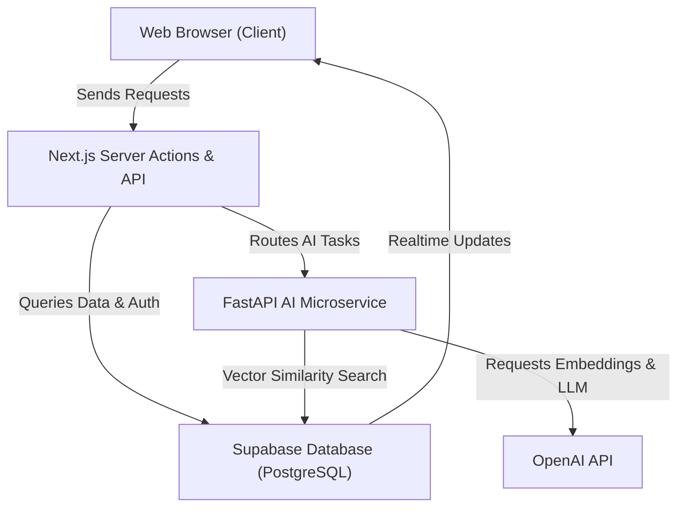

# ActionLens AI

## Project Information

Project Name:
ActionLens AI

Tagline:
IGAD Decision Intelligence Platform for Early Warning & Climate Resilience

Team:
ActionLens AI Core Team

Repository:
https://github.com/Maajolawasanjo/ActionLens-AI

Live Demo:
https://action-lens-ai.vercel.app/

Demo Video:
[YouTube Product Demo Link]

---

## Project Overview

ActionLens AI is a decision intelligence platform designed to translate raw environmental telemetry and climate data into role-specific, actionable directives for stakeholders in the East Africa IGAD sub-region. The Horn of Africa faces frequent, severe climate events such as flash floods, landslides, and droughts. While regional early warning systems exist, they typically generate broad warnings that fail to guide local actions. This results in "action paralysis," where local communities and response agencies receive alerts but lack the concrete instructions needed to coordinate effectively. This gap frequently leads to avoidable losses of lives and agricultural capital.

ActionLens AI addresses this by providing tailor-made guidance checklists to citizens, first responders, NGOs, government officials, and health workers. By converting weather telemetry, flood reports, satellite observations, and community submissions into operational decisions tailored to each stakeholder, the platform reduces decision time by transforming early warnings into role-specific action plans within seconds.

---

## Solution Details

The platform ingests real-time telemetry from environmental sensors and crowd-sourced hazard reports. Upon onboarding, users complete a profile establishing their role and region to receive a personalized dashboard interface. Citizens can report local incidents, upload geo-tagged photos, and receive immediate safety instructions. Responders access real-time dispatch timelines and incident locations, while government officials view regional analytics and coordinate funding.

ActionLens AI relies on OpenAI APIs for three core capabilities: GPT-4o for structured emergency decision generation, GPT-4o Vision for validating community-submitted disaster images, and text-embedding-3-small for semantic retrieval of disaster policies through a RAG pipeline.

Unlike existing platforms that broadcast generic alerts, ActionLens AI isolates responsibilities by stakeholder role. This ensures that every actor—from a farmer safeguarding grain stores to a state administrator releasing disaster response funds—receives a customized, actionable checklist rather than a generic weather warning.

---

## Why ActionLens AI is Different

* **Role-Specific Checklists Instead of Generic Alerts**: Translates broad regional warnings into concrete tasks for specific actors, preventing action paralysis.
* **AI-Verified Citizen Science**: Uses multi-modal vision to filter out false or low-quality hazard reports before dispatcher review.
* **Grounded Retrieval-Augmented Generation**: Answers policy and SOP questions by searching regional guidelines (using text-embedding-3-small in pgvector) instead of generating hallucinations.
* **Multi-Stakeholder Collaboration**: Synchronizes real-time logistical state between citizens, first responders, NGOs, and state officials.
* **Real-Time Map Synchronization**: Feeds live crowdsourced reports to a shared geospatial map via WebSockets immediately.
* **Global-Ready Resilient Architecture**: Decouples Next.js frontend, Supabase database, and FastAPI microservice layers to scale under emergency workloads.

---

## Technology Stack

| Layer | Technology | Description |
| :--- | :--- | :--- |
| Frontend | React 19, Next.js 16.2.10 | Core framework for user interfaces and page routing. |
| Backend | FastAPI (Python 3.11+) | Async Python microservice for AI processing and integrations. |
| Database | Supabase PostgreSQL | Relational data storage for profiles, reports, and logs. |
| Authentication | Supabase Auth | Session-based cookie verification and JWT access control. |
| AI Models | OpenAI GPT-4o, GPT-4o-mini | Core LLM models for recommendation generation and image classification. |
| Embeddings | OpenAI text-embedding-3-small | 1536-dimensional embedding generation for policy documentation. |
| Vector Database | Supabase pgvector extension | Vector similarity storage and cosine distance retrieval. |
| GIS | PostGIS | Geographic Point and geometry calculations for coordinates. |
| Realtime | Supabase Realtime | WebSocket listener for push updates on hazard alerts. |
| Storage | Supabase Storage | File storage for citizen hazard report attachments. |
| Deployment | Vercel, Docker | Cloud hosting environments for web and API layers. |
| Languages | TypeScript, Python, SQL | Primary programming languages. |
| Frameworks | Next.js (App Router), FastAPI | Client-side and server-side frameworks. |
| Libraries | Leaflet, Recharts, Framer Motion | Utilities for mapping, charts, and animations. |

---

## Key Features

### Core Winning Features

* **AI Recommendations**: Instantly generates localized action checklists customized by user role and region, reducing response delay from hours to seconds.
* **Vision AI Verification**: Multi-modal image analysis validating physical reports in real time to filter noise and prevent false alarms.
* **Community Reports**: Geotagged hazard reports submitted by citizens, facilitating local-to-regional disaster logging.
* **Interactive Disaster Map**: Visualizes regional alerts, verified community hazards, shelters, and hospital capacities.
* **RAG Emergency Assistant**: Conversational assistant answering protocol questions grounded in NDMA and ICPAC SOPs with document citations.

### Supporting Platform Capabilities

* **Role-Based Dashboards**: Isolated interfaces for Citizens, Responders, NGOs, Governments, and Administrators.
* **Real-Time Data Feeds**: Dynamic WebSocket synchronization updating map overlays and notifications without reloads.
* **Impact Consequence Simulator**: Displays estimated displacement numbers and infrastructure threat vectors depending on evacuation delay.
* **Admin Control Panel**: Back-office suite managing system prompt templates, indexing RAG documents, and tracking API cost metrics.

---

## User Roles

### Citizen
Focuses on local safety. Receives immediate weather updates, routes safe evacuation corridors, downloads survival checksheets, and reports local dangers with photographic attachments.

### Emergency Responder
Acts as the field crew. Monitors active incidents, reviews GPS coordinates, updates team deployment states, and uses dispatch checklists.

### Government
Maintains high-level oversight. Inspects regional analytics, views consequence estimations, exports situation reports, and authorizes disaster budgets.

### NGO
Coordinates humanitarian aid. Views shelter occupancies, monitors food and water logistics, and logs volunteer allocations across camps.

### Administrator
Manages platform operations. Tracks daily API token expenses, edits system prompt templates, adds document vectors, and toggles system maintenance flags.

---

## AI Features

### 1. Tailored Recommendation Engine
Uses GPT-4o to analyze sensor telemetry and user profile details. Synthesizes concrete tasks and safety checklists customized for the specific role (e.g. harvesting guidance for farmers, dispatch orders for fire crews).

### 2. Multi-Modal Vision Verification
Invokes GPT-4o Vision to examine user-uploaded report photos. Compares visual evidence against description text to filter out false alarms, outputting verification status, confidence score, and severity level.

### 3. Policy RAG Assistant
Integrates semantic search using vector embeddings (`text-embedding-3-small`) stored in `pgvector`. Retrieves matching paragraphs from disaster guidelines and generates structured answers citing official files.

---

## Architecture Summary

- **Next.js**: Serves the user interface, manages session routing, and passes API requests.
- **FastAPI**: Handles Python integrations, performing async API operations for AI processing.
- **Supabase**: Controls user sessions, manages relational data, and provides real-time client syncing.
- **OpenAI**: Powers the generation of text directives, image checks, and vector embeddings.
- **pgvector**: Computes cosine distance similarities within PostgreSQL for RAG matches.
- **Realtime**: Maintains active WebSockets to push regional warnings to the client.
- **Storage**: Hosts image attachments uploaded during hazard reporting.

---

## Deployment

### GitHub Repository
https://github.com/Maajolawasanjo/ActionLens-AI

### Live Application
https://action-lens-ai.vercel.app/

### Demo Video
[YouTube Product Demo Link]

---

## Future Improvements

- **USSD and SMS Fallback**: Integration with regional SMS gateways to allow users without internet access to report hazards and receive AI checklists.
- **Advanced Consequence Simulation**: Incorporation of machine learning regression models mapping rainfall curves to crop losses.
- **Offline Syncing Nodes**: Local community servers caching regional databases to maintain core maps and checklists during internet blackouts.
- **Multi-Model Backup Strategy**: Auto-failover logic routing requests to open-source models (e.g. Llama-3) if external APIs go offline.
- **Satellite and Map AI Auto-Detection**: Integration with Google Maps Platform and high-resolution satellite imagery pipelines to automatically scan geographic sectors for early signals of flooding, drought, or wildfires, generating automated hazard alerts without requiring manual user reports.
