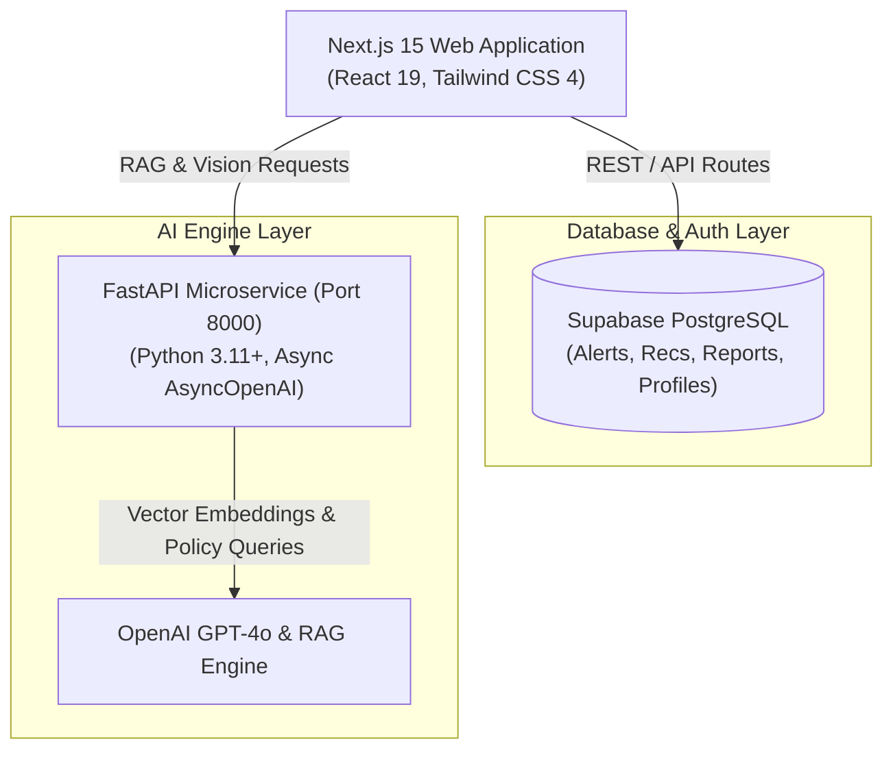

# ActionLens AI

> **IGAD Decision Intelligence Platform for Early Warning & Climate Resilience.**

ActionLens AI transforms complex satellite telemetry, climate risk feeds, and crowdsourced hazard reports into role-tailored, actionable early warning recommendations across the Horn of Africa.

---

## 🌟 Key Highlights (Verified Working Features)

- **🤖 GPT-4o RAG Policy Assistant**: Interactive decision intelligence assistant grounded in regional disaster management policies and guidelines, accessible directly from the stakeholder command dashboard.
- **👁️ Multimodal Vision AI Verification**: Automated image verification microservice analyzing citizen hazard photos to evaluate legitimacy, hazard severity, and damage indicators.
- **📊 Live Supabase Data Pipeline**: HTTP 200 OK dashboard data pipeline serving 8 active regional hazards/alerts and 12 prioritized stakeholder recommendations directly from PostgreSQL.
- **🗺️ Interactive GIS Risk Map**: Visual spatial mapping of active climate risks, flood warnings, and drought incidents across IGAD member states.
- **🔒 Hardened Stakeholder Auth & Onboarding**: Complete signup/login authentication flow with strict input validation, duplicate email detection, password strength enforcement, and 6 role-tailored perspectives.

---

## 🎯 Problem & Target Users

Climate disasters such as flash floods and severe droughts in the IGAD region (Horn of Africa) frequently cause catastrophic losses due to delayed, generic alerts that fail to inform specific local actions. ActionLens AI bridges the gap between raw early warning data and emergency response by delivering role-tailored, actionable recommendations for **6 key stakeholder personas**:

1. **Government Officials**: Strategic resource allocation and emergency declaration metrics.
2. **NGO Humanitarian Leads**: Relief distribution planning and vulnerable population tracking.
3. **First Responders**: Tactical deployment coordinates and evacuation route management.
4. **Agro-Agents / Farmers**: Agricultural risk mitigation and crop/livestock protection advisories.
5. **Public Health Workers**: Disease outbreak prevention and medical supply positioning.
6. **Citizens & Residents**: Localized hazard reporting and immediate safety guidance.

---

## 🔗 Links & Resources

- **Live Platform Demo**: *[Add Production Deployment URL]*
- **Demonstration Video**: *[Add 3-Minute Hackathon Demo Video Link]*
- **FastAPI Microservice Health**: `http://localhost:8000/health`

---

## 🏗️ Architecture & Data Flow

ActionLens AI uses a high-performance three-tier architecture: Next.js 15 for the responsive stakeholder interface, Supabase for relational data storage and real-time state, and a FastAPI Python microservice running GPT-4o for RAG decision intelligence and vision analysis.



---

## 🛠️ Technology Stack

- **Frontend Framework**: Next.js 15.2.10 (App Router), React 19
- **Language**: TypeScript
- **Styling**: Tailwind CSS 4, Lucide React Icons
- **Database & Storage**: Supabase (PostgreSQL, Supabase Storage, Realtime)
- **AI Microservice**: FastAPI (Python 3.11+), Async OpenAI GPT-4o, Pydantic v2
- **Vector Search / RAG**: pgvector & OpenAI text-embedding-3-small

---

## 🚀 Local Setup & Installation Guide

Follow these steps to run the ActionLens AI platform locally.

### Prerequisites
- Node.js 18+
- Python 3.11+
- Git

### 1. Repository Setup & Environment Variables
Clone the repository and create your local environment configuration:
```bash
git clone https://github.com/Maajolawasanjo/ActionLens-AI.git
cd ActionLens-AI

# Create .env.local from template
cp .env.example .env.local
```

Ensure `.env.local` contains valid Supabase and OpenAI credentials:
```env
NEXT_PUBLIC_SUPABASE_URL=https://your-project.supabase.co
NEXT_PUBLIC_SUPABASE_ANON_KEY=your_anon_key
SUPABASE_SERVICE_ROLE_KEY=your_service_role_key
OPENAI_API_KEY=sk-proj-your_openai_key
FASTAPI_MICROSERVICE_URL=http://localhost:8000
```

### 2. Install Dependencies
Install Node.js dependencies for the web frontend:
```bash
npm install
```

Set up Python virtual environment and install FastAPI dependencies:
```bash
cd fastapi
python3 -m venv .venv
source .venv/bin/activate
pip install -r requirements.txt
cd ..
```

### 3. Run Development Servers

**Terminal 1 — Next.js Web Server**:
```bash
npm run dev
# Running on http://localhost:3000
```

**Terminal 2 — FastAPI AI Microservice**:
```bash
cd fastapi
source .venv/bin/activate
uvicorn main:app --reload --port 8000
# Running on http://localhost:8000
```

---

## 📈 Current Implementation Status

### Fully Implemented & Verified
- ✅ **Dashboard Data Pipeline**: `/api/dashboard/summary` & `/api/recommendations` serving 8 live regional alerts and 12 recommendations with HTTP 200 OK.
- ✅ **RAG Decision Intelligence**: FastAPI assistant endpoint (`POST /api/ai/assistant`) connected to GPT-4o.
- ✅ **Multimodal Vision Verification**: FastAPI vision endpoint (`POST /api/ai/verify-report`) analyzing hazard image submissions.
- ✅ **Authentication & Onboarding**: Form validation (email regex, 8+ char password with numbers, matching confirm password, role selection), duplicate email detection, and profile persistence.
- ✅ **Community Reporting**: Citizen hazard report submission (`POST /api/community/reports`) and user task completion toggles (`PATCH /api/user/actions`).

### In Progress / Planned Future Extensions
- ⏳ **SMS/USSD Offline Gateway**: Twilio / Africa's Talking integration for feature phones in remote low-connectivity regions.
- ⏳ **Automated Satellite Feed Webhooks**: Direct real-time ingest pipeline for Sentinel-2 satellite imagery.

---

## 👥 Team & Acknowledgments

Built for the **IGAD Early Warning & Disaster Resilience Hackathon 2026**.

- **Developer**: ActionLens AI Team (`@exploitx` / `@Maajolawasanjo`)
- **Repository**: [https://github.com/Maajolawasanjo/ActionLens-AI](https://github.com/Maajolawasanjo/ActionLens-AI)
