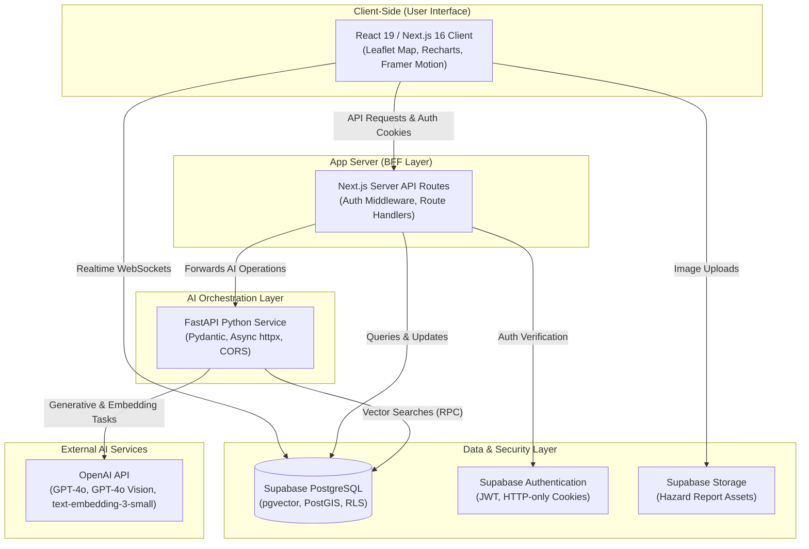
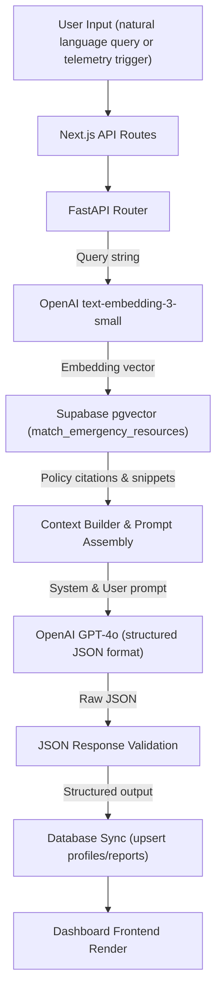

# ActionLens AI

## Project Information

Project Name: ActionLens AI  
Tagline: ICPAC-Aligned Early Warning & Anticipatory Action Platform for Climate Resilience in East Africa  
Short Description: An AI-powered Early Warning & Anticipatory Action Platform that converts environmental telemetry, ground reports, and satellite data into role-specific, actionable checklist directives for communities, responders, and administrators in East Africa.

### Badges

[](LICENSE)
[](https://nextjs.org)
[](https://fastapi.tiangolo.com)
[](https://supabase.com)
[](https://openai.com)
[](https://vercel.com)

### Links

* **Live Demo:** [https://action-lens-ai.vercel.app/](https://action-lens-ai.vercel.app/)
* **GitHub Repository:** [https://github.com/Maajolawasanjo/ActionLens-AI](https://github.com/Maajolawasanjo/ActionLens-AI)
* **Demo Video:** [https://youtu.be/ZdnzdotLYT8](https://youtu.be/ZdnzdotLYT8)
* **FastAPI Service Health:** `http://localhost:8000/health`

---

## Table of Contents

* [Project Description](#project-description)
* [Problem Statement](#problem-statement)
* [Solution Overview](#solution-overview)
* [Key Features](#key-features)
* [AI Capabilities](#ai-capabilities)
* [User Roles and Permissions](#user-roles-and-permissions)
* [System Architecture](#system-architecture)
* [Technology Stack](#technology-stack)
* [Project Structure](#project-structure)
* [Installation Guide](#installation-guide)
* [Environment Variables](#environment-variables)
* [Database Architecture](#database-architecture)
* [API Overview](#api-overview)
* [AI Workflow](#ai-workflow)
* [Security and Authentication](#security-and-authentication)
* [Performance Optimizations](#performance-optimizations)
* [Deployment Guide](#deployment-guide)
* [Roadmap](#roadmap)
* [Contributing](#contributing)
* [License](#license)
* [Acknowledgements](#acknowledgements)

---

## Project Description

ActionLens AI is an AI-powered Early Warning & Anticipatory Action Platform designed to support climate adaptation, disaster preparedness, and community resilience in the East African Intergovernmental Authority on Development (IGAD) sub-region. The platform acts as a bridge between broad regional meteorological forecasts and the targeted field operations required during sudden climate shocks. It aggregates regional environmental data, processes it via an advanced AI reasoning layer, and delivers isolated, actionable preparedness protocols to multiple stakeholders simultaneously.

---

## Problem Statement

Climate shocks in the Horn of Africa—characterized by sudden flash floods, landslides, and prolonged droughts—routinely cause devastating crop failures, community displacement, and loss of life. While early warning telemetry exists through agencies such as ICPAC and national meteorological bureaus, these alerts fail to coordinate local responses. They broadcast broad warnings (e.g., "expected high rainfall") that suffer from:

* **Action Paralysis:** Local actors receive warnings but lack contextual guides telling them exactly what actions to execute.
* **Coordination Gaps:** First responders, NGOs, and citizens operate on isolated feeds, leading to duplicate or misaligned efforts.
* **Lack of Validation:** Crowdsourced ground reports are flooded with visual noise, making it difficult for responders to prioritize resources.
* **Unstructured Policy Retrieval:** In crisis scenarios, searching through hundreds of pages of government standard operating procedures (SOPs) is slow and impractical.

---

## Solution Overview

ActionLens AI addresses these gaps by translating meteorological alerts and local telemetry into targeted, role-specific checklists. The solution ensures that when an early warning is triggered, a government official is prompted to authorize anticipatory funding, a responder receives clear evacuation routes, an NGO lead gets shelter capacity notifications, and a citizen receives immediate agricultural protection guides. 

By utilizing OpenAI GPT-4o for structured anticipatory action checklist generation, GPT-4o Vision for verifying citizen-submitted Ground Reports, and pgvector for semantic retrieval of disaster policies, the platform reduces decision time from hours to seconds.

---

## Key Features

### AI Intelligence

* **Structured Recommendation Engine:** Converts regional risk factors and environmental sensors into localized anticipatory action lists.
* **Vision AI Verification:** Evaluates user-submitted Ground Reports using computer vision to confirm categories and estimate severity.
* **Policy RAG Assistant:** Dialogue interface that parses official disaster response guidelines to answer natural language queries with citations.

### Emergency Operations

* **Live Spatial Hazard Map:** Interactive geographic display of active hazards, emergency shelters, and local hospital capacities.
* **Dispatch Timeline:** Real-time logging of disaster response milestones and deployment actions.
* **Ground Reports Registry:** Portal for geotagged hazard uploads, allowing residents to log local dangers with image attachments.

### Decision Support

* **Anticipatory Risk & Impact Forecast:** Visualizes projected casualties and agricultural losses based on evacuation delay.
* **Regional Analytics:** Displays charts tracking alert types, average response times, and predictive analytics.
* **Emergency Resource Directory:** Direct access list of emergency contacts, shelter coordinates, and logistics directories.

---

## AI Capabilities

ActionLens AI is built around advanced Large Language Model pipelines to deliver robust, reliable decisions during high-stress scenarios:

* **GPT-4o Reasoning:** Used in `/generate-recommendations` to structure role-based anticipatory directives in JSON format based on specific variables (role, country, region, risk type, and telemetry metrics).
* **GPT-4o Vision Processing:** Used in `/verify-report-vision` to analyze base64 or publicly hosted image uploads. It checks Ground Report descriptions against actual visual evidence to verify authenticity and assess physical damage.
* **Embeddings and Semantic Retrieval:** Uses `text-embedding-3-small` to encode disaster policies and matches user queries against policy vectors in PostgreSQL using cosine distance metrics.
* **Structured Outputs:** Uses Pydantic schemas in FastAPI to enforce exact structural boundaries on LLM responses, ensuring consistent schema integration.
* **AI Guardrails:** Incorporates prompt system templates that restrict AI replies strictly to provided operational contexts, preventing model hallucinations.

---

## User Roles and Permissions

ActionLens AI separates permissions and command views into five targeted stakeholder roles:

### Citizen (Ground Reporter)
* **Core Activities:** Submits Ground Reports with photos, monitors early warning advisories, views evacuation routes, and retrieves safety guides.
* **Permissions:** Read-only access to early warning advisories; write-only access to their own Ground Reports.

### Emergency Responder
* **Core Activities:** Receives dispatch coordinate logs, views real-time hazard vectors, monitors timeline logs, and checks rescue checklists.
* **Permissions:** Read access to Ground Reports registries; write access to dispatch timeline milestones.

### Government Official
* **Core Activities:** Accesses regional hazard analytics and impact forecasts, exports situational briefs, runs impact simulation scripts, and authorizes relief budgets.
* **Permissions:** Full read access to regional data; write access to official early warning alerts.

### NGO Logistics Lead
* **Core Activities:** Tracks shelter capacities, logs food and water supply levels, and oversees volunteer distribution arrays across displacement camps.
* **Permissions:** Read access to regional alerts; write access to shelter inventory metrics.

### System Administrator
* **Core Activities:** Modifies LLM prompt templates, inspects API cost monitors, uploads RAG documents, and toggles system maintenance states.
* **Permissions:** Unrestricted read and write access to prompt registries, document embedding pipelines, and configuration variables.

---

## System Architecture

ActionLens AI is organized as a decoupled three-tier architecture designed for high availability and low latency:



### Components

* **Next.js Web Server:** Handles server-side page rendering, handles user cookie sessions, and acts as a gateway forwarding complex tasks.
* **FastAPI AI Microservice:** Runs Python-based async pipelines for image verification and RAG processing, decoupling heavy compute tasks from page rendering.
* **Supabase Database:** Relational PostgreSQL store configured with `pgvector` for similarity calculations and `PostGIS` for point coordinates.
* **Supabase Realtime:** Uses WebSockets to broadcast new hazard logs and alert changes to clients immediately without page reloads.

---

## Technology Stack

### Frontend Stack

| Technology | Version | Purpose |
| :--- | :--- | :--- |
| React | 19.2.4 | UI component rendering |
| Next.js | 16.2.10 | Core framework and API route handlers |
| Tailwind CSS | 4.0.0 | Layout styling |
| Leaflet | 1.9.4 | Interactive geographic risk mapping |
| Recharts | 2.15.0 | Telemetry and status charting |
| Framer Motion | 11.18.2 | Fluid state transition animations |

### Backend & AI Stack

| Technology | Version | Purpose |
| :--- | :--- | :--- |
| FastAPI | 0.110.0 | Async Python microservice framework |
| Uvicorn | 0.29.0 | ASGI web server for Python service |
| AsyncOpenAI | 1.14.1 | Asynchronous client communication with OpenAI |
| OpenAI Models | GPT-4o | Recommendation generation, RAG, and Vision analysis |
| Embeddings Model| text-embedding-3-small | 1536-dimensional vector generation |
| Pydantic | 2.6.4 | Strict schema definition and type validation |

### Database & Hosting

| Technology | Service | Purpose |
| :--- | :--- | :--- |
| PostgreSQL | Supabase | Main relational data store |
| pgvector | Extension | Vector similarity calculations |
| PostGIS | Extension | Geospatial coordinates and distance queries |
| Supabase Auth | Service | Secure cookie-based user authentication |
| Supabase Storage | Service | Upload storage for report image attachments |
| Vercel | Cloud Platform | Host environment for Next.js web application |
| Docker | Platform | Containerization for FastAPI microservice |

---

## Project Structure

```text
ActionLens-AI/
├── backend/            # Architecture specifications and system configuration guidelines
├── docs/               # Architecture design papers and system blueprints
├── fastapi/            # FastAPI Python microservice (AI processing, Vision, RAG)
│   ├── main.py         # Main API routes (Vision, recommendations, vector similarity)
│   └── requirements.txt# Python package dependencies
├── public/             # Branding assets, vector icons, and static assets
├── src/                # Next.js web application (React, TypeScript)
│   ├── app/            # Next.js App Router (dashboard tabs, routes, and auth controllers)
│   │   ├── (public)/   # Public pages (login, registration, password recoveries)
│   │   ├── api/        # Next.js backend API routes
│   │   └── dashboard/  # Protected unified command dashboard interface
│   ├── components/     # UI components (map modules, analytics cards, assistant widgets)
│   ├── hooks/          # React hooks (realtime sync, telemetry tracking)
│   ├── lib/            # Configuration scripts (Supabase clients, validations)
│   └── services/       # Client fetch utilities
├── supabase/           # Database schema files and seed scripts
│   └── migrations/     # Database structures, RLS policies, and triggers
├── Dockerfile          # Multi-stage production container configuration
└── docker-compose.yml  # Multi-container local orchestration script
```

---

## Installation Guide

Follow these steps to configure and execute ActionLens AI locally.

### Prerequisites

* Node.js 18.0.0 or higher
* Python 3.11 or higher
* Git

### Step 1: Clone the Repository

```bash
git clone https://github.com/Maajolawasanjo/ActionLens-AI.git
cd ActionLens-AI
```

### Step 2: Configure Environment Variables

Duplicate the template file to set up environment credentials:

```bash
cp .env.example .env.local
```

Edit `.env.local` to include your Supabase keys and OpenAI API secret key.

### Step 3: Install Node Dependencies

```bash
npm install
```

### Step 4: Configure the Python Environment

Set up a virtual environment and install FastAPI libraries:

```bash
cd fastapi
python3 -m venv .venv
source .venv/bin/activate
pip install -r requirements.txt
cd ..
```

### Step 5: Start Development Servers

Run both servers concurrently.

**Terminal 1 (Next.js Application):**

```bash
npm run dev
```

**Terminal 2 (FastAPI Microservice):**

```bash
cd fastapi
source .venv/bin/activate
uvicorn main:app --reload --port 8000
```

Open `http://localhost:3000` in your web browser.

---

## Environment Variables

| Variable Name | Purpose | Required? |
| :--- | :--- | :--- |
| `NEXT_PUBLIC_SUPABASE_URL` | Endpoint URL of the Supabase project instance | Yes |
| `NEXT_PUBLIC_SUPABASE_ANON_KEY` | Public client API key for accessing database tables | Yes |
| `SUPABASE_SERVICE_ROLE_KEY` | Administrative secret bypass key used only in secure backend handlers | Yes |
| `OPENAI_API_KEY` | Secret access key for billing API operations on OpenAI | Yes |
| `FASTAPI_MICROSERVICE_URL` | Local or remote url pointing to the Python AI service | Yes |

---

## Database Architecture

ActionLens AI runs on PostgreSQL, utilizing key extensions to handle geospatial points and high-dimensional search indices.

### Tables

* `public.profiles`: Stores user registration details, linked via a cascade reference foreign key to `auth.users(id)`.
* `public.risk_data`: Contains telemetry observations and coordinates.
* `public.community_reports`: Stores citizen incident submissions, geotagging coordinates, and verification details.
* `public.user_actions`: Keeps track of checkbox completion markers linked to users and recommendations.
* `public.alert_subscriptions`: Stores contact logs for SMS and email alerts.

### Extensions

* **PostGIS:** Configures coordinates as geometry points to calculate distance zones from shelters.
* **pgvector:** Indexes 1536-dimensional float arrays representing RAG document embeddings, enabling cosine similarity matching.

### Triggers

* `on_auth_user_created`: A PostgreSQL trigger that fires after an entry is added to `auth.users`, automatically inserting a matching profile row to `public.profiles`.

---

## API Overview

### Next.js API Routes

* `POST /api/auth/register`: Creates a user in Supabase Auth and updates local tables.
* `POST /api/auth/login`: Validates credentials and sets HTTP-only cookies.
* `GET /api/auth/me`: Decodes session credentials and returns active profiles.
* `GET /api/dashboard/summary`: Fetches global incident statistics and alerts.
* `POST /api/community/reports`: Submits crowdsourced disaster reports.
* `POST /api/community/upload`: Handles file streams to Supabase bucket containers.

### FastAPI AI Endpoints

* `POST /generate-recommendations`: Takes telemetry readings and generates customized directives using GPT-4o.
* `POST /verify-report-vision`: Evaluates base64 report photos using GPT-4o Vision.
* `POST /rag-query`: Takes query strings, generates search embeddings, and returns contextual answers using `text-embedding-3-small` and GPT-4o.
* `GET /health`: Returns service operation states.

---

## AI Workflow

The diagram below outlines the logical path taken when an operational query is processed by the AI microservice:



---

## Security and Authentication

* **Session Validation:** Secured via Supabase Auth JSON Web Tokens (JWT) stored in HTTP-only cookies, protecting transactions against XSS.
* **Row-Level Security (RLS):** Policies are enforced at the database level so that users can modify only their own profiles or reports.
* **Input Sanitization:** Uses Zod schemas on Next.js endpoints and Pydantic validation on FastAPI to filter malformed input payloads.
* **Security Definer Triggers:** Profile triggers execute in isolated secure contexts, preventing users from altering administrative flags.

---

## Performance Optimizations

* **Asynchronous Execution:** FastAPI routes utilize `httpx.AsyncClient` and asynchronous database hooks to handle concurrent requests without blocking.
* **Optimized Vector Search:** Index queries use custom PostgreSQL vector indexes with a threshold boundary, preventing full-table scans.
* **Static Generation:** General dashboard layouts are optimized using static shells, loading dynamic data asynchronously to maintain fast page load times.

---

## Deployment Guide

### Web Frontend (Vercel)

The Next.js application is configured to deploy directly to Vercel. Ensure all variables specified in the Environment Variables table are set in the Vercel Project Dashboard.

### AI Microservice (Docker)

The microservice includes a production-ready `Dockerfile`. You can deploy the container using:

```bash
docker build -t actionlens-ai-backend .
docker run -p 8000:8000 --env-file .env actionlens-ai-backend
```

### Database (Supabase)

Initialize database schemas by executing migrations sequentially through the Supabase SQL editor or local CLI pipelines.

---

## Roadmap

### Current MVP
* Decoupled FastAPI and Next.js layers.
* Unified dashboard supporting 5 roles.
* Vision verification and vector policy searches.

### Next Version
* USSD gateways integrated using Twilio to support offline SMS reporting.
* Geographic routing updates to include regional road closure states.

### Future Vision
* Integration with automated satellite feeds to scan regional sectors for early environmental anomalies.

---

## Contributing

1. Fork the project repository.
2. Create a branch for your feature (`git checkout -b feature/NewCapability`).
3. Commit your changes (`git commit -m 'Add new capability'`).
4. Push to the branch (`git push origin feature/NewCapability`).
5. Open a Pull Request.

---

## License

This project is licensed under the MIT License - see the [LICENSE](LICENSE) file for details.

---

## Acknowledgements

* **OpenAI:** Developer of GPT-4o, GPT-4o Vision, and text-embedding-3-small models.
* **Supabase:** Providers of PostgreSQL hosting, pgvector, and real-time synchronization.
* **Vercel:** Providers of hosting infrastructure for the Next.js frontend application.
* **IGAD & ICPAC:** Standard resource authors for disaster warning policies in East Africa.
